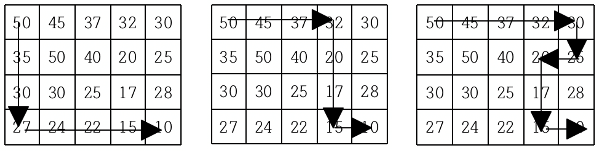

<div align='center'>


</div>

<br>

> 이 게시글은 [백준 1520번 내리막 길](https://www.acmicpc.net/problem/1520) 문제를 풀이합니다. 언어는 *Javascript*입니다.

<br>

# 문제
여행을 떠난 세준이는 지도를 하나 구하였다. 이 지도는 아래 그림과 같이 직사각형 모양이며 여러 칸으로 나뉘어져 있다. 한 칸은 한 지점을 나타내는데 각 칸에는 그 지점의 높이가 쓰여 있으며, 각 지점 사이의 이동은 지도에서 상하좌우 이웃한 곳끼리만 가능하다.

<br>

<div align='center'>


</div>

<br>

현재 제일 왼쪽 위 칸이 나타내는 지점에 있는 세준이는 제일 오른쪽 아래 칸이 나타내는 지점으로 가려고 한다. 그런데 가능한 힘을 적게 들이고 싶어 항상 높이가 더 낮은 지점으로만 이동하여 목표 지점까지 가고자 한다. 위와 같은 지도에서는 다음과 같은 세 가지 경로가 가능하다.

<br>

<div align='center'>



</div>

<br>

지도가 주어질 때 이와 같이 제일 왼쪽 위 지점에서 출발하여 제일 오른쪽 아래 지점까지 항상 내리막길로만 이동하는 경로의 개수를 구하는 프로그램을 작성하시오.

<br>

# 입력
> 첫째 줄에는 지도의 세로의 크기 M과 가로의 크기 N이 빈칸을 사이에 두고 주어진다. 이어 다음 M개 줄에 걸쳐 한 줄에 N개씩 위에서부터 차례로 각 지점의 높이가 빈 칸을 사이에 두고 주어진다. M과 N은 각각 500이하의 자연수이고, 각 지점의 높이는 10000이하의 자연수이다.

## 예제 입력 1

```
4 5
50 45 37 32 30
35 50 40 20 25
30 30 25 17 28
27 24 22 15 10
```

<br>

# 출력
> 첫째 줄에 이동 가능한 경로의 수 H를 출력한다. 모든 입력에 대하여 H는 10억 이하의 음이 아닌 정수이다.

## 예제 출력 1

```
3
```

<br>

# 풀이
## 접근
일반적인 DFS, BFS를 생각할 수 있습니다. 그러나 입력이 많고, 여러 방향의 길을 `중복으로` 탐색할 수 있으므로 단순하게 완전 탐색을 실시하면 시간초과가 납니다.

따라서 구현 로직은 완전 탐색을 따르나, `항상 높이가 더 낮은 지점`으로 이동할 수 있는 조건을 산정하여 cache 해 놓으면 쉬운 형태로 정답에 접근할 수 있습니다.

<br>

## 알고리즘(의사 코드)
> [의사 코드 바로 읽기](./1520.txt)

<br>

## 구현
> [구현 코드 바로 읽기](./1520.js)

<br>

# 참고
## 구조
- images : 문제 관련 이미지 폴더
- 1520.txt : 의사 코드
- 1520.js : 구현 코드
- stdin : 테스트 케이스

<br>

## 같이 읽기
- []()

<br>

