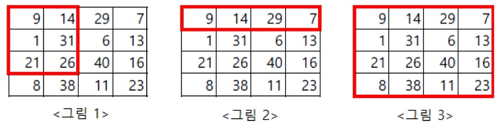

<div align='center'>


</div>

<br>

> 이 게시글은 [백준 15724번 주지수](https://www.acmicpc.net/problem/15724) 문제를 풀이합니다. 언어는 *Javascript*입니다.

<br>

# 문제
네모 왕국의 왕인 진경대왕은 왕국의 영토를 편하게 통치하기 위해서 1X1의 단위 구역을 여러 개 묶어서 하나의 거대 행정구역인 주지수(州地數, 마을의 땅을 셈)를 만들 예정이다. 진경대왕은 주지수를 만들기 위해서 일정한 직사각형 범위 내에 살고 있는 사람 수를 참고 자료로 쓰고 싶어한다.

<br>

<div align='center'>



</div>

<br>

진경대왕은 굉장히 근엄한 왕이기 때문에 당신에게 4개의 숫자로 직사각형 범위를 알려줄 것이다.

예를 들어, 위와 같이 사람이 살고 있다고 가정할 때 <그림 1>의 직사각형 범위의 사람 수를 알고 싶다면 진경대왕은 네 개의 정수 1 1 3 2를 부를 것이다. 마찬가지로 <그림 2>는 1 1 1 4, <그림 3>은 1 1 4 4가 될 것이다.

진경대왕을 위하여 이 참고 자료를 만들어내는 프로그램을 작성해보자.

<br>

# 입력
> 첫째 줄에 영토의 크기 N, M(1 ≤ N, M ≤ 1,024)이 주어진다.

> 다음 N개의 줄에는 M개의 정수로 단위 구역 내에 살고 있는 사람 수가 주어진다. 각 단위 구역 내에 살고 있는 사람 수는 100명 이하이며, 각 단위 구역 별 최소 1명의 사람은 살고 있다.

> 그 다음 줄에는 진경대왕이 인구 수를 궁금해하는 직사각형 범위의 개수 K(1 ≤ K ≤ 100,000)가 주어진다.

> 다음 K개의 줄에는 네 개의 정수로 직사각형 범위 x<sub>1</sub>, y<sub>1</sub>, x<sub>2</sub>, y<sub>2</sub>가 주어진다(x<sub>1</sub> ≤ x<sub>2</sub>, y<sub>1</sub> ≤ y<sub>2</sub>).

## 예제 입력 1

```
4 4
9 14 29 7
1 31 6 13
21 26 40 16
8 38 11 23
3
1 1 3 2
1 1 1 4
1 1 4 4
```

<br>

# 출력
> K개의 줄에 순서대로 주어진 직사각형 범위 내에 살고 있는 사람 수의 합을 출력한다.

## 예제 출력 1

```
102
59
293
```

<br>

# 풀이
## 접근
주어지는 테스트케이스마다 루프를 돌면 보나마나 O<sub>n</sub><sup>2</sup>의 시간복잡도가 소요될 것으로 생각되었습니다. 주어지는 예제는 시작 지점이 [1, 1]이라 간과할 수 있으나 이는 구간 합을 구하면 되겠죠? 순서는 아래와 같습니다.

1. 우선 1부터 4까지의 누적 합을 계산합니다.
2. 구하는 구간이 3에서 4라면 1에서 2까지의 누적 합을 제거합니다.

1차원 배열이 아닌 2차원 배열로 확장해서 생각합시다.

<br>

## 알고리즘(의사 코드)
> [의사 코드 바로 읽기](./15724.txt)

<br>

## 구현
> [구현 코드 바로 읽기](./15724.js)

<br>

# 참고
## 구조
- images : 문제 관련 이미지
- 15724.txt : 의사 코드
- 15724.js : 구현 코드
- stdin : 테스트 케이스

<br>

## 같이 읽기
- [부분합 구하기 : 누적합만 들고 있으면 된다.](https://codingdog.tistory.com/entry/%EB%B6%80%EB%B6%84%ED%95%A9-%EA%B5%AC%ED%95%98%EA%B8%B0-%EB%88%84%EC%A0%81%ED%95%A9%EB%A7%8C-%EB%93%A4%EA%B3%A0-%EC%9E%88%EC%9C%BC%EB%A9%B4-%EB%90%9C%EB%8B%A4)