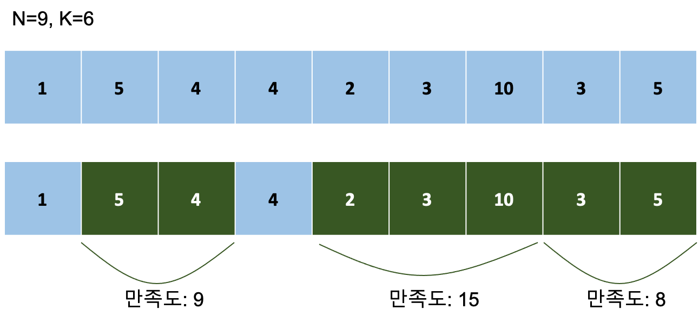

<div align='center'>


</div>

<br>

> 이 게시글은 [백준 20181번 꿈틀꿈틀 호석 애벌레 - 효율성](https://www.acmicpc.net/problem/20181) 문제를 풀이합니다. 언어는 *Javascript*입니다.

<br>

# 문제
꿈틀꿈틀 호석 애벌레는 N 개의 먹이가 일렬로 나열된 나뭇가지를 오른쪽으로 기어가려고 한다. 시작하는 순간의 호석 애벌레가 0의 위치에 있고 i 번째 먹이는 오른쪽으로 i 초 기어가야 도달할 수 있다. 또한 매초 1 만큼 오른쪽으로 무조건 진행한다.

호석 애벌레는 i 번째 먹이가 맛있을수록 높은 만족도를 얻는다. 호석 애벌레는 절제라는 것을 모르는 욕심쟁이기 때문에 한번 먹이를 먹기 시작하면 연속적으로 계속 먹어야 하며, 누적된 만족도가 최소 만족도 K  이상이 되거나 더 이상 먹을 먹이가 없을 때에 연속적으로 먹는 것을 멈춘다. 만약 최소 만족도 이상이 되면 K 를 초과한 만족도만큼 탈피 에너지를 축적한다. 직후에 호석 애벌레의 만족도는 다시 0 이 되고 먹이를 먹을 수 있게 된다. 나뭇가지를 전부 통과했을 때에 소화를 다 못 했을 경우에도 탈피 에너지는 최소 만족도를 넘기는 순간 이미 축적한 것으로 생각하자.

<br>

<div align='center'>



</div>

<br>

예를 들어 위와 같이 9개의 먹이가 존재하면, 호석 애벌레는 미래를 도모하여 1번 먹이를 과감하게 포기한다. 그리고 2번부터 먹기 시작해서 3번까지 먹으면 만족도가 9가 되어 3의 에너지를 축적하게 된다. 같은 이유로 4번 먹이도 포기하고 5번부터 먹으면 7번까지 연속으로 먹어서 15의 만족도를 얻는다. 이를 통해 9의 탈피 에너지가 쌓인다. 8, 9번 먹이까지 먹게 되면 2의 탈피 에너지가 축적된다. 이렇게 얻은 총 14의 탈피 에너지가 위의 예제에서는 최대치이다.

매초마다 호석 애벌레는 오른쪽으로 이동하면서 먹이를 지나치거나 먹기 시작할 수 있다. 먹기 시작하면 만족도가 채워질때까지 먹게 될것이다. 어떤 먹이들을 대해 먹어야 축적된 탈피 에너지가 최대가 될 수 있을까?

<br>

# 입력
> 첫번째 줄에 먹이 개수 N, 최소 만족도 K 가 공백으로 주어진다.

> 두번째 줄에는 1 번부터 N 번 먹이의 만족도가 순서대로 주어진다.

## 예제 입력 1

```
3 5
3 4 5
```

## 예제 입력 2

```
9 6
1 5 4 4 2 3 10 3 5
```

<br>

# 출력
> 축적된 탈피 에너지의 최댓값을 구하라. 만약 탈피를 한 번도 할 수 없다면 0을 출력한다.

## 예제 출력 1

```
4
```

## 예제 출력 2

```
14
```

<br>

# 제한
- 1 ≤ N ≤ 100,000, N 은 정수이다.
- 1 ≤ K ≤ 10<sup>8</sup>, K 는 정수이다.
- 0 ≤ 각 먹이의 만족도 ≤ 10<sup>8</sup>, 모든 만족도는 정수이다.

<br>

# 풀이
## 접근


<br>

## 알고리즘(의사 코드)
> [의사 코드 바로 읽기](./20181.txt)

<br>

## 구현
> [구현 코드 바로 읽기](./20181.js)

<br>

# 참고
## 구조
- images : 문제 관련 이미지 폴더
- 20181.txt : 의사 코드
- 20181.js : 구현 코드
- stdin : 테스트 케이스

<br>

## 같이 읽기
- []()

<br>

