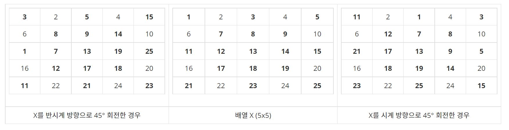

<div align='center'>


</div>

<br>

> 이 게시글은 백준 [17276번 배열 돌리기](https://www.acmicpc.net/problem/17276) 문제를 풀이합니다. 언어는 *Javascript*입니다.

<br>

# 문제
크기가 n x n인 2차원 정수 배열 X가 있다. (n은 홀수)

X를 45° 의 배수만큼 시계방향 혹은 반시계방향으로 돌리려고 한다. X를 시계 방향으로 45° 돌리면 아래와 같은 연산이 동시에 X에 적용되어야 한다:
- X의 주 대각선을 ((1,1), (2,2), …, (n, n)) 가운데 열 ((n+1)/2 번째 열)로 옮긴다.
- X의 가운데 열을 X의 부 대각선으로 ((n, 1), (n-1, 2), …, (1, n)) 옮긴다. 
- X의 부 대각선을 X의 가운데 행 ((n+1)/2번째 행)으로 옮긴다.
- X의 가운데 행을 X의 주 대각선으로 옮긴다.
- 위 네 가지 경우 모두 원소의 기존 순서는 유지 되어야 한다.
- X의 다른 원소의 위치는 변하지 않는다.

반시계 방향으로 45° 돌리는 경우도 위와 비슷하게 정의된다.

예를 들어, 아래 그림 중앙에 5x5 배열 X가 있고, 이 배열을 시계방향 혹은 반시계방향으로 45° 돌렸을 때의 결과가 우측 그리고 좌측에 있다. 굵은 원소는 주 대각선 / 중간 열 / 부 대각선 / 중간 행에 위치한 원소이다.

<br>

<div align='center'>



</div>

<br>

입력으로 2차원 배열 X와 어느 방향으로 몇 도 회전할지 입력 받아, 그 결과를 출력하는 프로그램을 작성하시오.

<br>

# 입력
> 첫 줄에 테스트 케이스의 수 T가 주어진다 (1 ≤ T ≤ 10).

> 각 테스트 케이스에 대해: 첫 줄에 배열의 크기를 나타내는 n (1 ≤ n < 500, n은 홀수) 그리고 각도 d가 주어진다. d는 0 ≤ |d| ≤ 360 을 만족하며 |d| 는 45의 배수이다. d가 양수이면 시계방향으로 d° 돌려야 하고, 음수이면 반시계방향으로 |d|° 돌려야 한다. 다음 n줄에 걸쳐 각 줄에 n개의 정수가 공백으로 구분되어 주어진다 (X의 원소들을 나타낸다). 각 값은 1 이상 1,000,000 이하의 정수이다.

## 예제 입력 1

```
4
5 45
1 2 3 4 5
6 7 8 9 10
11 12 13 14 15
16 17 18 19 20
21 22 23 24 25
5 -45
1 2 3 4 5
6 7 8 9 10
11 12 13 14 15
16 17 18 19 20
21 22 23 24 25
5 135
1 2 3 4 5
6 7 8 9 10
11 12 13 14 15
16 17 18 19 20
21 22 23 24 25
5 360
1 2 3 4 5
6 7 8 9 10
11 12 13 14 15
16 17 18 19 20
21 22 23 24 25
```

<br>

# 출력
> 각 테스트 케이스에 대해 회전 연산을 마친 후 배열의 상태를 출력한다. n줄에 걸쳐 각 줄에 n개의 정수를 공백으로 구분하여 출력한다. 

## 예제 출력 1

```
11 2 1 4 3 
6 12 7 8 10 
21 17 13 9 5 
16 18 19 14 20 
23 22 25 24 15 
3 2 5 4 15 
6 8 9 14 10 
1 7 13 19 25 
16 12 17 18 20 
11 22 21 24 23 
23 2 21 4 11 
6 18 17 12 10 
25 19 13 7 1 
16 14 9 8 20 
15 22 5 24 3 
1 2 3 4 5
6 7 8 9 10
11 12 13 14 15 
16 17 18 19 20
21 22 23 24 25
```

<br>

# 풀이
## 접근
주어진 조건만 구현하면 되는 문제입니다. 입력 받은 테스트 케이스를 어떻게 풀어놓느냐가 관건이었네요. 아래처럼 흐름을 한 번 적어보고 진행했습니다.

1. 테스트 케이스의 갯수만큼 입력 값을 정제합니다.
2. 회전에 대한 상세 요건을 정립했습니다.
  - `45도`는 1번 오른쪽으로 회전하는 것.
  - `-45도`는 결국 315도 회전한 것이죠? 7번 오른쪽으로 회전하는 것.
  - 나머지는 45도로 나누어 몫 연산을 했습니다. 90 / 45 = 2, 135 / 45 = 3 처럼요.
3. 회전을 몇 번 할 건지에 대한 값이 나왔다면, 반복문으로 여러 번 회전합니다.
4. 내부 반복문을 조건에 따라 정의하여 매핑했습니다.

주어지는 수가 더 커진다면 현재의 로직으론 메모리상, 시간상 많은 문제가 있으니 조금 더 효율성있게 짜는 방법을 고안해야 합니다.

주어진 입력값에 대한 조건을 한 번 가시화해볼까요? 45도 1회전했을 때를 가정합니다.

- `X의 주 대각선을 ((1,1), (2,2), …, (n, n)) 가운데 열 ((n+1)/2 번째 열)로 옮긴다.`

  | 원래 값 | 변환 값 |
  | ------- | ------- |
  | 1, 1    | 1, 3    |
  | 2, 2    | 2, 3    |
  | 3, 3    | 3, 3    |
  | 4, 4    | 4, 3    |
  | 5, 5    | 5, 3    |

- `X의 가운데 열을 X의 부 대각선으로 ((n, 1), (n-1, 2), …, (1, n)) 옮긴다. `

  | 원래 값 | 변환 값 |
  | ------- | ------- |
  | 1, 3    | 1, 5    |
  | 2, 3    | 2, 4    |
  | 3, 3    | 3, 3    |
  | 4, 3    | 4, 2    |
  | 5, 3    | 5, 1    |

- `X의 부 대각선을 X의 가운데 행 ((n+1)/2번째 행)으로 옮긴다.`

  | 원래 값 | 변환 값 |
  | ------- | ------- |
  | 1, 5    | 3, 1    |
  | 2, 4    | 3, 2    |
  | 3, 3    | 3, 3    |
  | 4, 2    | 3, 4    |
  | 5, 1    | 3, 5    |


- `X의 가운데 행을 X의 주 대각선으로 옮긴다.`

  | 원래 값 | 변환 값 |
  | ------- | ------- |
  | 3, 1    | 1, 1    |
  | 3, 2    | 2, 2    |
  | 3, 3    | 3, 3    |
  | 3, 4    | 4, 4    |
  | 3, 5    | 5, 5    |

이런 형태로 규칙을 찾아 구현하면 됩니다.

<br>

## 알고리즘(의사 코드)
> [의사 코드 바로 읽기](./17276.txt)

<br>

## 구현
> [구현 코드 바로 읽기](./17276.js)

<br>

# 참고
## 구조
- images : 문제 관련 이미지
- 17276.txt : 의사 코드
- 17276.js : 구현 코드
- stdin : 테스트 케이스

<br>

## 같이 읽기
- [배열 회전 알고리즘 : 읽는 방법만 생각하면 어렵지 않아요.](https://codingdog.tistory.com/entry/%EB%B0%B0%EC%97%B4-%ED%9A%8C%EC%A0%84-%EC%95%8C%EA%B3%A0%EB%A6%AC%EC%A6%98-%EC%9D%BD%EB%8A%94-%EB%B0%A9%EB%B2%95%EB%A7%8C-%EC%83%9D%EA%B0%81%ED%95%98%EB%A9%B4-%EC%96%B4%EB%A0%B5%EC%A7%80-%EC%95%8A%EC%95%84%EC%9A%94)

<br>

