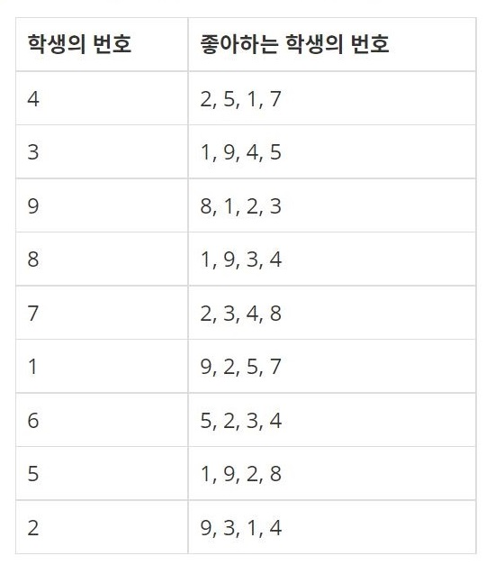
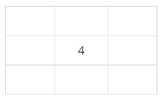
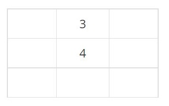
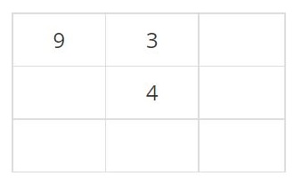
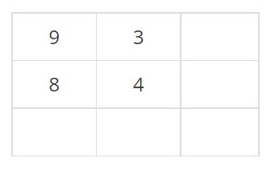
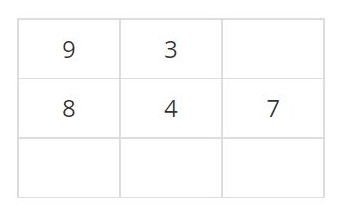
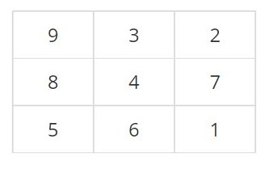

<div align='center'>


</div>

<br>

> 이 게시글은 [백준 21608번 상어 초등학교](https://www.acmicpc.net/problem/21608) 문제를 풀이합니다. 언어는 *Javascript*입니다.

<br>

# 문제
상어 초등학교에는 교실이 하나 있고, 교실은 N×N 크기의 격자로 나타낼 수 있다. 학교에 다니는 학생의 수는 N<sup>2</sup>명이다. 오늘은 모든 학생의 자리를 정하는 날이다. 학생은 1번부터 N<sup>2</sup>번까지 번호가 매겨져 있고, (r, c)는 r행 c열을 의미한다. 교실의 가장 왼쪽 윗 칸은 (1, 1)이고, 가장 오른쪽 아랫 칸은 (N, N)이다.

선생님은 학생의 순서를 정했고, 각 학생이 좋아하는 학생 4명도 모두 조사했다. 이제 다음과 같은 규칙을 이용해 정해진 순서대로 학생의 자리를 정하려고 한다. 한 칸에는 학생 한 명의 자리만 있을 수 있고, |r<sub>1</sub> - r<sub>2</sub>| + |c<sub>1</sub> - c<sub>2</sub>| = 1을 만족하는 두 칸이 (r<sub>1</sub>, c<sub>1</sub>)과 (r<sub>2</sub>, c<sub>2</sub>)를 인접하다고 한다.

1. 비어있는 칸 중에서 좋아하는 학생이 인접한 칸에 가장 많은 칸으로 자리를 정한다.
2. 1을 만족하는 칸이 여러 개이면, 인접한 칸 중에서 비어있는 칸이 가장 많은 칸으로 자리를 정한다.
3. 2를 만족하는 칸도 여러 개인 경우에는 행의 번호가 가장 작은 칸으로, 그러한 칸도 여러 개이면 열의 번호가 가장 작은 칸으로 자리를 정한다.

예를 들어, N = 3이고, 학생 N<sup>2</sup>명의 순서와 각 학생이 좋아하는 학생이 다음과 같은 경우를 생각해보자.

<br>

<div align='center'>



</div>

<br>

가장 먼저, 4번 학생의 자리를 정해야 한다. 현재 교실의 모든 칸은 빈 칸이다. 2번 조건에 의해 인접한 칸 중에서 비어있는 칸이 가장 많은 칸인 (2, 2)이 4번 학생의 자리가 된다.

<br>

<div align='center'>



</div>

<br>

다음 학생은 3번이다. 1번 조건을 만족하는 칸은 (1, 2), (2, 1), (2, 3), (3, 2) 이다. 이 칸은 모두 비어있는 인접한 칸이 2개이다. 따라서, 3번 조건에 의해 (1, 2)가 3번 학생의 자리가 된다.

<br>

<div align='center'>



</div>

<br>

다음은 9번 학생이다. 9번 학생이 좋아하는 학생의 번호는 8, 1, 2, 3이고, 이 중에 3은 자리에 앉아있다. 좋아하는 학생이 가장 많이 인접한 칸은 (1, 1), (1, 3)이다. 두 칸 모두 비어있는 인접한 칸이 1개이고, 행의 번호도 1이다. 따라서, 3번 조건에 의해 (1, 1)이 9번 학생의 자리가 된다.

<br>

<div align='center'>



</div>

<br>

이번에 자리를 정할 학생은 8번 학생이다. (2, 1)이 8번 학생이 좋아하는 학생과 가장 많이 인접한 칸이기 때문에, 여기가 그 학생의 자리이다.

<br>

<div align='center'>



</div>

<br>

7번 학생의 자리를 정해보자. 1번 조건을 만족하는 칸은 (1, 3), (2, 3), (3, 1), (3, 2)로 총 4개가 있고, 비어있는 칸과 가장 많이 인접한 칸은 (2, 3), (3, 2)이다. 행의 번호가 작은 (2, 3)이 7번 학생의 자리가 된다.

<br>

<div align='center'>



</div>

<br>

이런식으로 학생의 자리를 모두 정하면 다음과 같다.

<br>

<div align='center'>



</div>

<br>

이제 학생의 만족도를 구해야 한다. 학생의 만족도는 자리 배치가 모두 끝난 후에 구할 수 있다. 학생의 만족도를 구하려면 그 학생과 인접한 칸에 앉은 좋아하는 학생의 수를 구해야 한다. 그 값이 0이면 학생의 만족도는 0, 1이면 1, 2이면 10, 3이면 100, 4이면 1000이다.

학생의 만족도의 총 합을 구해보자.

<br>

# 입력
> 첫째 줄에 N이 주어진다. 둘째 줄부터 N<sup>2</sup>개의 줄에 학생의 번호와 그 학생이 좋아하는 학생 4명의 번호가 한 줄에 하나씩 선생님이 자리를 정할 순서대로 주어진다.

> 학생의 번호는 중복되지 않으며, 어떤 학생이 좋아하는 학생 4명은 모두 다른 학생으로 이루어져 있다. 입력으로 주어지는 학생의 번호, 좋아하는 학생의 번호는 N<sup>2</sup>보다 작거나 같은 자연수이다. 어떤 학생이 자기 자신을 좋아하는 경우는 없다.

## 예제 입력 1

```
3
4 2 5 1 7
3 1 9 4 5
9 8 1 2 3
8 1 9 3 4
7 2 3 4 8
1 9 2 5 7
6 5 2 3 4
5 1 9 2 8
2 9 3 1 4
```
```
3
4 2 5 1 7
2 1 9 4 5
5 8 1 4 3
1 2 9 3 4
7 2 3 4 8
9 8 4 5 7
6 5 2 3 4
8 4 9 2 1
3 9 2 1 4
```

<br>

# 출력
> 첫째 줄에 학생의 만족도의 총 합을 출력한다.

## 예제 출력 1

```
54
```
```
1053
```

<br>

# 제한
- 3 ≤ N ≤ 20

<br>

# 풀이
## 접근
### 1차 접근
짝수, 홀수든 자바스크립트 논리대로 N / 2를 하면 중앙이었기에 가지치기를 사용해서 효율적으로 짜보려고 했습니다. 그러기 위해서 주어지는 교실의 크기를 미리 정수로 구해두고, 각 루프별로 하나씩 감소 시키는 형태였죠.

탑다운(Top-down) 형식으로 구현했었습니다. 미리 상하좌우 좌표를 선언해두고, 시작 좌표부터 탐색하는 형태로 진행했죠. 시작 좌표는 **입력된 순서대로** 앉으니, 무조건 중아에서부터 시작한다고 가정했습니다.

학생과 앉은 자리를 Map() 객체로 구현했으나, **인접한 비어있는 자리 수**와 **인접한 좋아하는 학생 수**를 검사하고 판단하는 로직이 엉켜 있었습니다.

결국 아래와 같은 프로세스로 흘러가고 있었습니다.
1. 최초로 앉는 사람은 무조건 중앙(N / 2)
2. 다음 학생의 좋아하는 사람 중에 최초로 앉은 사람이 포함된다면 : 해당 좌표부터 상하좌우 탐색, 탐색한 상하좌우 좌표로부터 다시 인접한 빈 공간과 좋아하는 사람 수 탐색
   - 이미 여기서 로직이 망가진 것을 눈치챌 수 있죠?
3. 다음 학생의 좋아하는 사람 중에 최초로 앉은 사람이 포함되지 않는다면 : 빈 공간이 가장 많이 인접한 후보군을 선별하고, 3번 조건에 해당하는 좌표를 앉힘
   - 여기서 다시 한 번 로직이 분기될 수밖에 없는 흐름입니다. 옳지 않았어요.
4. 2, 3 프로세스의 결과로 좌표, 인접한 빈 공간, 인접한 좋아하는 사람 수를 배열로 만들어 반환합니다.
5. 해당 배열을 다시 파싱합니다...
   1. 좋아하는 인접한 사람 수로 우선 정렬
   2. 인접한 빈 공간 수로 정렬
   3. 행, 열로 정렬
6. 좌석을 한 칸 줄이고, 위의 과정을 좌석이 남지 않을 때까지 반복합니다.

결과는... 인접한 좋아하는 사람 수에 대한 조건 분기가 정상적으로 되지 않아 인접한 빈 칸의 수로만 학생을 앉히게 되었고, 1번 예제의 출력 값으로 아래와 같았습니다.

```
0 3 0
8 4 7
0 6 0
```

다른 수를 강구했습니다.

<br>

### 2차 접근
가지치기 없이, 행렬을 탐색하면서 구현해볼까? DFS, BFS로 풀면 충분히 풀릴 법 한데 너무 멀리 돌아온 느낌이 들었습니다.

1차 접근때의 내용과 크게 다른 점이 있느냐? 하면 가지치기를 제외하고 완전 탐색을 실시하도록 변경한 것입니다.

다시 주어진 조건을 분석했습니다.

1. `비어있는 칸 중에서 좋아하는 학생이 인접한 칸에 가장 많은 칸으로 자리를 정한다.`
  - 인접한 칸의 좋아하는 학생의 수를 저장할 상위 변수를 하나 두기로 했습니다.

2. `1을 만족하는 칸이 여러 개이면, 인접한 칸 중에서 비어있는 칸이 가장 많은 칸으로 자리를 정한다.`
  - 인접한 칸의 비어있는 칸의 수를 저장할 상위 변수를 하나 두기로 했습니다.

3. `2를 만족하는 칸도 여러 개인 경우에는 행의 번호가 가장 작은 칸으로, 그러한 칸도 여러 개이면 열의 번호가 가장 작은 칸으로 자리를 정한다.`
  - 정렬을 사용하지 않는다면... 좌표를 역차탐색하면 큰 값부터 들어가기 시작하니, 최종적으로 해당 조건문에 완벽한 반복문이 탄생할 것 같네요!

도출된 내용으로 DFS 함수를 구현했습니다. 첫 탐색 시 어떤 칸도 차 있지 않으므로 2번 조건에 의해 무조건 중앙에 위치하게 됩니다. 프로세스는 아래와 같죠.

1. 탐색하는 좌표가 비어있다면 상하좌우를 탐색해서 비어있는지/좋아하는 학생이 앉아있는지 검사
   1. 우선, 상위 변수와 비교할 하위 변수를 두고 루프를 돌며 유효성을 검사합니다.
   2. 탐색이 끝났다면 각 변수끼리 비교합니다.

2. 현재 인접한 수가 좋아하는 사람이 인접한 수보다 크다면 아래 프로세스를 따릅니다.
   1. 좋아하는 사람이 인접한 총 수 != 현재 좌표에서 좋아하는 사람과 인접한 수라면 현재 좌표와 각각의 총 값을 현재 루프에서의 변수 값으로 대체합니다.
   2. 좋아하는 사람이 인접한 총 수 === 현재 좌표에서 좋아하는 사람과 인접한 수라면 비어있는 인접한 총 수와 현재 좌표에서 인접한 빈 칸의 수를 비교하고, 대체합니다.

3. 최종 좌표값을 반환해줍니다.

반환된 좌표값으로 **입력된 순서대로** 학생들을 앉힙니다.

```
9 3 2
8 4 7
5 6 1
```

됐습니다! 이제 좌표별 완전 탐색으로 만족도를 구하면 끝입니다.

<br>

## 알고리즘(의사 코드)
> [의사 코드 바로 읽기](./21608.txt)

<br>

## 구현
> [구현 코드 바로 읽기](./21608.js)

<br>

# 참고
## 구조
- images : 문제 관련 이미지
- 21608.txt : 의사 코드
- 21608.js : 구현 코드
- stdin : 테스트 케이스

<br>