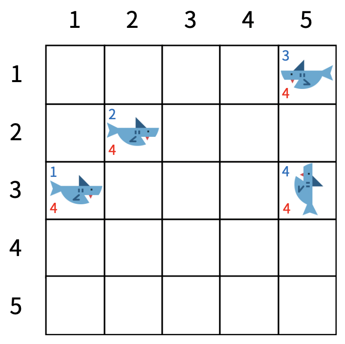
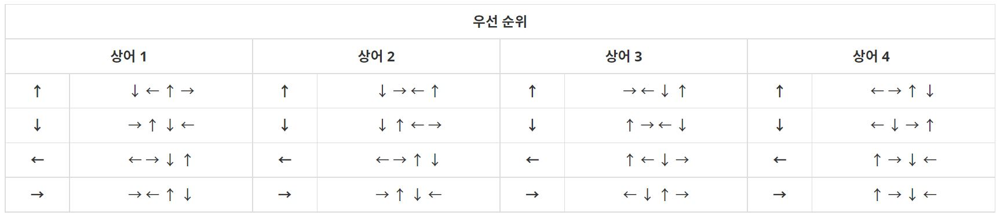
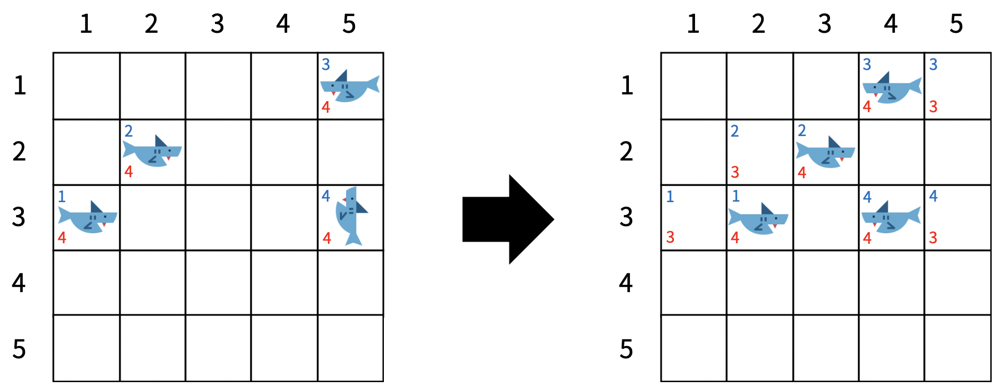
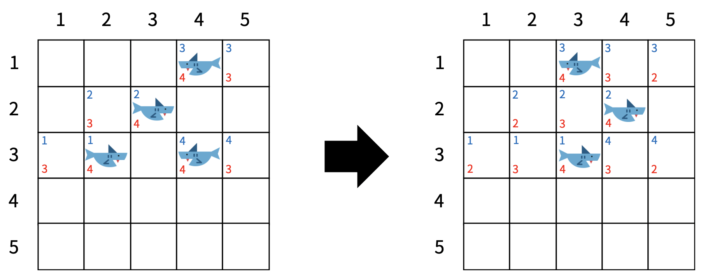
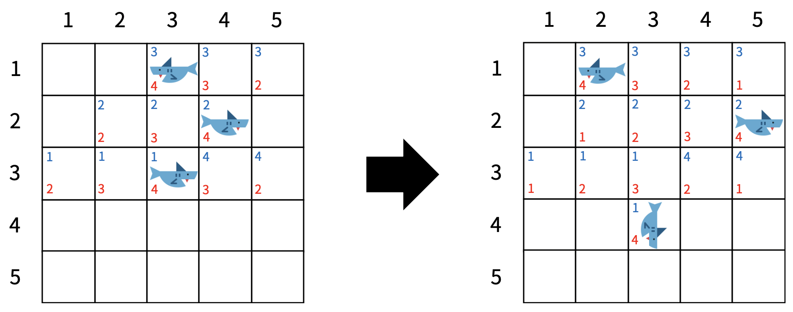
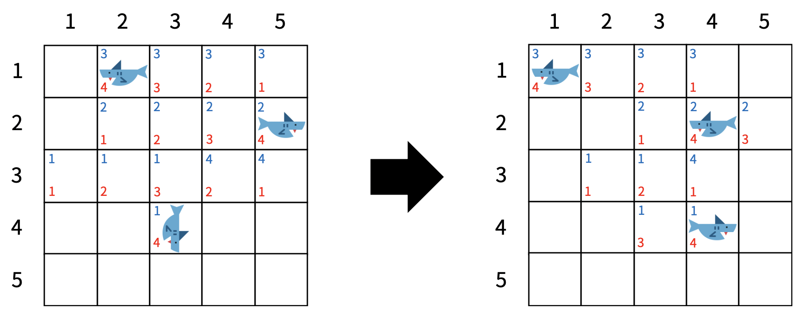

<div align='center'>


</div>

<br>

> 이 게시글은 [백준 19237번 어른 상어](https://www.acmicpc.net/problem/19237) 문제를 풀이합니다. 언어는 *Javascript*입니다.

<br>

# 문제
청소년 상어는 더욱 자라 어른 상어가 되었다. 상어가 사는 공간에 더 이상 물고기는 오지 않고 다른 상어들만이 남아있다. 상어에는 1 이상 M 이하의 자연수 번호가 붙어 있고, 모든 번호는 서로 다르다. 상어들은 영역을 사수하기 위해 다른 상어들을 쫓아내려고 하는데, 1의 번호를 가진 어른 상어는 가장 강력해서 나머지 모두를 쫓아낼 수 있다.

N×N 크기의 격자 중 M개의 칸에 상어가 한 마리씩 들어 있다. 맨 처음에는 모든 상어가 자신의 위치에 자신의 냄새를 뿌린다. 그 후 1초마다 모든 상어가 동시에 상하좌우로 인접한 칸 중 하나로 이동하고, 자신의 냄새를 그 칸에 뿌린다. 냄새는 상어가 k번 이동하고 나면 사라진다.

각 상어가 이동 방향을 결정할 때는, 먼저 인접한 칸 중 아무 냄새가 없는 칸의 방향으로 잡는다. 그런 칸이 없으면 자신의 냄새가 있는 칸의 방향으로 잡는다. 이때 가능한 칸이 여러 개일 수 있는데, 그 경우에는 특정한 우선순위를 따른다. 우선순위는 상어마다 다를 수 있고, 같은 상어라도 현재 상어가 보고 있는 방향에 따라 또 다를 수 있다. 상어가 맨 처음에 보고 있는 방향은 입력으로 주어지고, 그 후에는 방금 이동한 방향이 보고 있는 방향이 된다.

모든 상어가 이동한 후 한 칸에 여러 마리의 상어가 남아 있으면, 가장 작은 번호를 가진 상어를 제외하고 모두 격자 밖으로 쫓겨난다.


<br>

<div align='center'>



<p><그림 1></p>

<br>



<p><표 1></p>

</div>

<br>

<그림 1>은 맨 처음에 모든 상어가 자신의 냄새를 뿌린 상태를 나타내며, <표 1>에는 각 상어 및 현재 방향에 따른 우선순위가 표시되어 있다. 이 예제에서는 k = 4이다. 왼쪽 하단에 적힌 정수는 냄새를 의미하고, 그 값은 사라지기까지 남은 시간이다. 좌측 상단에 적힌 정수는 상어의 번호 또는 냄새를 뿌린 상어의 번호를 의미한다.

<br>

<div align='center'>



<p><그림 2></p>

<br>



<p><그림 3></p>

</div>

<br>

<그림 2>는 모든 상어가 한 칸 이동하고 자신의 냄새를 뿌린 상태이고, <그림 3>은 <그림 2>의 상태에서 한 칸 더 이동한 것이다. (2, 4)에는 상어 2과 4가 같이 도달했기 때문에, 상어 4는 격자 밖으로 쫓겨났다.


<br>


<div align='center'>



<p><그림 4></p>

<br>



<p><그림 5></p>

</div>

<br>

<그림 4>은 격자에 남아있는 모든 상어가 한 칸 이동하고 자신의 냄새를 뿌린 상태, <그림 5>는 <그림 4>에서 한 칸 더 이동한 상태를 나타낸다. 상어 2는 인접한 칸 중에 아무 냄새도 없는 칸이 없으므로 자신의 냄새가 들어있는 (2, 4)으로 이동했다. 상어가 이동한 후에, 맨 처음에 각 상어가 뿌린 냄새는 사라졌다.

이 과정을 반복할 때, 1번 상어만 격자에 남게 되기까지 몇 초가 걸리는지를 구하는 프로그램을 작성하시오.

<br>

# 입력
> 첫 줄에는 N, M, k가 주어진다. (2 ≤ N ≤ 20, 2 ≤ M ≤ N2, 1 ≤ k ≤ 1,000)

> 그 다음 줄부터 N개의 줄에 걸쳐 격자의 모습이 주어진다. 0은 빈칸이고, 0이 아닌 수 x는 x번 상어가 들어있는 칸을 의미한다.

> 그 다음 줄에는 각 상어의 방향이 차례대로 주어진다. 1, 2, 3, 4는 각각 위, 아래, 왼쪽, 오른쪽을 의미한다.

> 그 다음 줄부터 각 상어의 방향 우선순위가 상어 당 4줄씩 차례대로 주어진다. 각 줄은 4개의 수로 이루어져 있다. 하나의 상어를 나타내는 네 줄 중 첫 번째 줄은 해당 상어가 위를 향할 때의 방향 우선순위, 두 번째 줄은 아래를 향할 때의 우선순위, 세 번째 줄은 왼쪽을 향할 때의 우선순위, 네 번째 줄은 오른쪽을 향할 때의 우선순위이다. 각 우선순위에는 1부터 4까지의 자연수가 한 번씩 나타난다. 가장 먼저 나오는 방향이 최우선이다. 예를 들어, 우선순위가 1 3 2 4라면, 방향의 순서는 위, 왼쪽, 아래, 오른쪽이다.

> 맨 처음에는 각 상어마다 인접한 빈 칸이 존재한다. 따라서 처음부터 이동을 못 하는 경우는 없다.

## 예제 입력 1

```
5 4 4
0 0 0 0 3
0 2 0 0 0
1 0 0 0 4
0 0 0 0 0
0 0 0 0 0
4 4 3 1
2 3 1 4
4 1 2 3
3 4 2 1
4 3 1 2
2 4 3 1
2 1 3 4
3 4 1 2
4 1 2 3
4 3 2 1
1 4 3 2
1 3 2 4
3 2 1 4
3 4 1 2
3 2 4 1
1 4 2 3
1 4 2 3
```

## 예제 입력 2

```
4 2 6
1 0 0 0
0 0 0 0
0 0 0 0
0 0 0 2
4 3
1 2 3 4
2 3 4 1
3 4 1 2
4 1 2 3
1 2 3 4
2 3 4 1
3 4 1 2
4 1 2 3
```

## 예제 입력 3

```
5 4 1
0 0 0 0 3
0 2 0 0 0
1 0 0 0 4
0 0 0 0 0
0 0 0 0 0
4 4 3 1
2 3 1 4
4 1 2 3
3 4 2 1
4 3 1 2
2 4 3 1
2 1 3 4
3 4 1 2
4 1 2 3
4 3 2 1
1 4 3 2
1 3 2 4
3 2 1 4
3 4 1 2
3 2 4 1
1 4 2 3
1 4 2 3
```

## 예제 입력 4

```
5 4 10
0 0 0 0 3
0 0 0 0 0
1 2 0 0 0
0 0 0 0 4
0 0 0 0 0
4 4 3 1
2 3 1 4
4 1 2 3
3 4 2 1
4 3 1 2
2 4 3 1
2 1 3 4
3 4 1 2
4 1 2 3
4 3 2 1
1 4 3 2
1 3 2 4
3 2 1 4
3 4 1 2
3 2 4 1
1 4 2 3
1 4 2 3
```

<br>

# 출력
> 1번 상어만 격자에 남게 되기까지 걸리는 시간을 출력한다. 단, 1,000초가 넘어도 다른 상어가 격자에 남아 있으면 -1을 출력한다.

## 예제 출력 1

```
14
```

## 예제 출력 2

```
26
```

## 예제 출력 3

```
-1
```

## 예제 출력 4

```
-1
```

<br>

# 풀이
## 접근


<br>

## 알고리즘(의사 코드)
> [의사 코드 바로 읽기](./19237.txt)

<br>

## 구현
> [구현 코드 바로 읽기](./19237.js)

<br>

# 참고
## 구조
- images : 문제 관련 이미지 폴더
- 19237.txt : 의사 코드
- 19237.js : 구현 코드
- stdin : 테스트 케이스

<br>

## 같이 읽기
- []()

<br>

